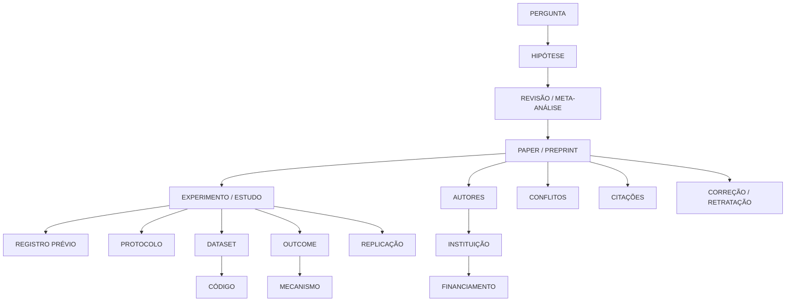

# EVIDENCE-GRAPH.md

## Princípio

Um paper não deve ser modelado como unidade isolada. O objeto correto é um grafo versionado de alegações e evidências, no qual cada aresta conserva sua origem, força, temporalidade e grau de automação.

## Esquema conceitual

## Tipos de aresta

| Aresta | Como pode ser descoberta | Grau esperado | Verificação necessária |
|---|---|---:|---|
| paper→DOI/PMID | Identificador explícito ou reconciliação de metadados | Automática | DOI resolver, título, autores e ano |
| paper→ensaio | NCT/registro no texto, suplemento ou metadado | Automática quando explícita; inferência quando ausente | Conferir amostra, intervenção, datas e outcomes |
| ensaio→protocolo | Link/DOI do protocolo ou documento do registro | Automática quando linkada | Comparar versão e desvios |
| paper→dataset | DOI/accession/URL em data availability, suplemento ou repositório | Semi-automática | Confirmar que o dataset é realmente usado |
| paper→código | URL, DOI de release, suplemento, container | Semi-automática | Congelar commit, licença e dependências |
| paper→financiamento | Funder statement, Crossref funding, grant ID | Automática se ID; NLP caso contrário | Normalizar funder e award |
| paper→autor→ORCID | ORCID explícito, Crossref, ORCID API | Probabilística | Afiliação, coautoria e período |
| autor→instituição→ROR | Afiliação textual e ROR/OpenAlex | Probabilística | Histórico institucional |
| paper→conflito | Declaração, suplemento, registro regulatório | NLP + confirmação | Distinguir ausência de declaração de ausência de conflito |
| paper→citação | Referências e cited-by em OpenAlex/Crossref/Semantic Scholar | Automática | Deduplicar e preservar direção |
| ensaio→replicação | Título, intervenção, protocolo, preregistro, autores e amostra | Inferência | Critério explícito de replicação |
| paper→correção/retração | Crossref update, PubMed/PMC e Retraction Watch | Automática + reconciliação | Tipo, data, versão e motivo |
| estudo→resultado negativo | Outcomes registrados versus publicados; estimativas e IC | Extração + julgamento | Não converter p>0,05 em “efeito zero” |

## Objeto de alegação

Cada resposta deve ser decomposta em alegações atômicas: `exposição`, `população`, `comparador`, `desfecho`, `janela temporal`, `efeito`, `incerteza`, `mecanismo`, `desenho`, `fonte` e `limitações`. Uma alegação só pode ser exibida como **EVIDÊNCIA** se apontar para um trecho, tabela, figura ou registro específico. O sistema deve distinguir “o artigo afirma” de “o conjunto de estudos sustenta”.

## Proveniência e qualidade

Cada nó e aresta deve registrar `source_url`, `source_id`, `retrieved_at`, `source_version`, `extraction_method`, `confidence`, `human_review`, `license` e `access_level`. A força da evidência não deve ser um único score opaco; deve decompor desenho, risco de viés, consistência, precisão, direcionalidade, preregistro, replicação e aplicabilidade.

## Automação versus inferência

A automação é confiável para PIDs explícitos, referências, downloads, versionamento, campos estruturados e detecção de atualizações. Ela é apenas candidata para desambiguação de autores, ligação paper–ensaio sem ID, identificação de replicações, extração de conflitos e classificação de resultados. Essas últimas relações devem entrar como `candidate_edge` até revisão ou confirmação independente.

## Referências
## Referências selecionadas

[1]: https://openalex.org/ "OpenAlex — The open catalog to the global research system"
[2]: https://docs.openalex.org/ "OpenAlex API documentation"
[3]: https://pubmed.ncbi.nlm.nih.gov/ "PubMed — NLM"
[4]: https://europepmc.org/RestfulWebService "Europe PMC RESTful Web Service"
[5]: https://api.crossref.org/ "Crossref REST API"
[6]: https://www.semanticscholar.org/product/api "Semantic Scholar API"
[7]: https://clinicaltrials.gov/data-api "ClinicalTrials.gov Data and API"
[8]: https://www.who.int/clinical-trials-registry-platform "WHO ICTRP"
[9]: https://www.cos.io/products/osf "OSF"
[10]: https://developers.zenodo.org/ "Zenodo REST API"
[11]: https://datadryad.org/api "Dryad API"
[12]: https://api.figshare.com/ "Figshare API"
[13]: https://arxiv.org/help/api "arXiv API"
[14]: https://www.biorxiv.org/ "bioRxiv"
[15]: https://www.medrxiv.org/ "medRxiv"
[16]: https://psyarxiv.com/ "PsyArXiv"
[17]: https://apidoc.protocols.io/ "protocols.io API"
[18]: https://www.ncbi.nlm.nih.gov/research/bionlp/APIs/ "NCBI Web APIs and PubTator"
[19]: https://reporter.nih.gov/ "NIH RePORTER"
[20]: https://cordis.europa.eu/ "CORDIS"
[21]: https://open.fda.gov/apis/drug/event/ "openFDA Drug Adverse Event API"
[22]: https://www.ema.europa.eu/en/medicines "EMA medicines"
[23]: https://www.gov.br/anvisa/pt-br "ANVISA"
[24]: https://www.wipo.int/en/web/patentscope "WIPO PATENTSCOPE"
[25]: https://www.epo.org/en/searching-for-patents/technical/espacenet "Espacenet"
[26]: https://patents.google.com/ "Google Patents"
[27]: https://retractionwatch.com/ "Retraction Watch"
[28]: https://bdtd.ibict.br/vufind/ "BDTD"
[29]: https://orcid.org/ "ORCID"
[30]: https://ror.org/ "Research Organization Registry"
[31]: https://datacite.org/ "DataCite"
[32]: https://pmc.ncbi.nlm.nih.gov/articles/PMC8321831/ "The Association Between Personality Traits and Dietary Choices: A Systematic Review"
[33]: https://pubmed.ncbi.nlm.nih.gov/42218644/ "Classic psychedelics and personality: An updated systematic review"
[34]: https://pmc.ncbi.nlm.nih.gov/articles/PMC5736032/ "Sharing and reuse of individual participant data from clinical trials"

